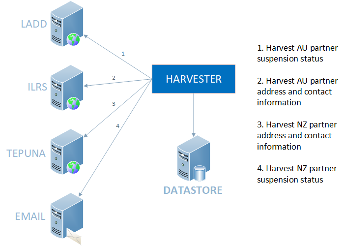
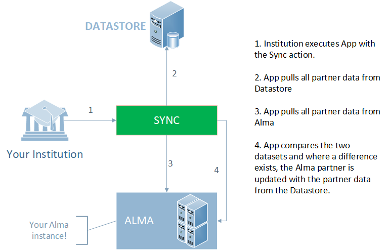

# Partner Synchronisation with Alma
__[HOME](README.md)__
## Table of Contents
- [Partner Synchronisation with Alma](README.md)
  - [Table of Contents](README.md#table-of-contents)
  - [Introduction](README.md#introduction)
  - [Problem](README.md#problem)
  - [Solution](README.md#solution)
  - [High Level Design Diagrams](README.md#high-level-design-diagrams)
    - [Harvesting Resource Sharing Partner Data](README.md#harvesting-resource-sharing-partner-data)
    - [Synchronising Resource Sharing Partner Data](README.md#synchronising-resource-sharing-partner-data)
- [Implementation](implementation.md)
  - [Obtaining the Software](implementation.md#obtaining-the-software)
  - [Installation](implementation.md#installation)
  - [Configuration](implementation.md#configuration)
- [Using the Application](usage.md)
  - [The Harvest Action](usage.md#the-harvest-action)
  - [The Preview Action](usage.md#the-preview-action)
  - [The Sync Action](usage.md#the-sync-action)
  - [Additional Features](usage.md#additional-features)
    - [Partner Override](usage.md#partner-override)
    - [Block Alma Partner Updating](usage.md#block-alma-partner-updating)
- [Harvesting Data Concepts](harvesting.md)
  - [Harvesting LADD (_Australia_)](harvesting.md#1-harvesting-ladd-australia)
  - [Harvesting ILRS (_Australia_)](harvesting.md#2-harvesting-ilrs-australia)
  - [Harvesting TEPUNA (_New Zealand_)](harvesting.md#3-harvesting-tepuna-new-zealand)
  - [Harvesting EMAIL (_New Zealand_)](harvesting.md#4-harvesting-email-new-zealand)
- [Configuring Outlook for Tepuna Status Emails](outlook-configuration.md)
  - [Creating an Outlook Account](outlook-configuration.md#creating-an-outlook-account)
  - [Creating an App Registration](outlook-configuration.md#creating-an-app-registration)
  - [Generating an Access Token](outlook-configuration.md#generating-an-access-token)

---
## Introduction
There are around 1000 institutions across Australia and New Zealand in the ILL (Inter Library Lending) partner network. To facilitate the ILL service, information regarding these partners is required. For each partner we require address and contact information and their suspension status.

While using the VDX system this information was centrally managed/updated. Partners using VDX had no need to manage any of this data. The same is true for partners using Relais (and possibly others).

Moving to Alma Resource Sharing the model is different. Although offering a much better level of service to our customers by having an integrated ILL solution with their LMS (Library Management System), partner managment becomes the burden of every partner using Alma Resource Sharing. There is no longer a centralised point of management for partner data.

This project seeks to provide a solution to enable automated loading and syncing of Resource Partners with the Alma system.

## Problem
We require the synchronisation of data for resource partners into Alma. There are multiple sources for this data and unfortunately there is no simple interface to obtain this information. Sources of data include web pages, web applications, csv files and emails. Breaking down the data requirements into the following four categories which align to the different data sources, we get the following:

1. _Australia_
   - Address and contact information:
     Web application: http://www.nla.gov.au/apps/ilrs
   - Suspension status:
     Website: https://www.nla.gov.au/librariesaustralia/connect/find-library/ladd-members-and-suspensions
2. _New Zealand_
   - Address and contact information:
     CSV: http://natlib.govt.nz/directory-of-new-zealand-libraries.csv
   - Suspension status:
     Email (structured)

Address and contact information for Australia can found at http://www.nla.gov.au/apps/ilrs. The page is a form that takes a NUC code for an institution and returns the address and contact information for that institution. This must be repeated for each Australian institution that is a part of the network. The result page then needs to be scraped.

Suspension information and NUC symbols for Australian partner institutions are located at https://trove.nla.gov.au/partners/partner-services/resource-sharing/suspensions. This page needs to be scraped to obtain whether partners are currently active or suspended. This is the most frequently changing data segment and needs to be updated at least daily.

Address and contact information for New Zealand partner information is provided by the National Library of New Zealand in the form of a maintained CSV file that is found at https://natlib.govt.nz/librarians/directory-of-new-zealand-libraries.csv.

Suspension information for New Zealand libraries is the most difficult to obtain as there is no complete list of current statuses. Instead, changed status information is broadcasted via email to subscribed email addresses. The status emails are encoded in a custom format that allows status change requests to be processed provided you have developed software to do so.

## Solution
Due to the complexity of the source data, it is not advisable to create a direct synchronisation to Alma as we cannot rely on source system text structure remaining unchanged. We will instead break the problem into two parts: -
1. Harvesting the information and updating a local data store.
1. Synchronising the local data store with Alma.

This provides us with a buffer for Alma should source data systems change or cease to function as expected. It also allows us to slowly change the way we harvest without affecting the data loads into Alma. Over time we are hoping that there will be better mechanisms for sourcing data.

## High Level Design Diagrams

### Harvesting Resource Sharing Partner Data

### Synchronising Resource Sharing Partner Data

