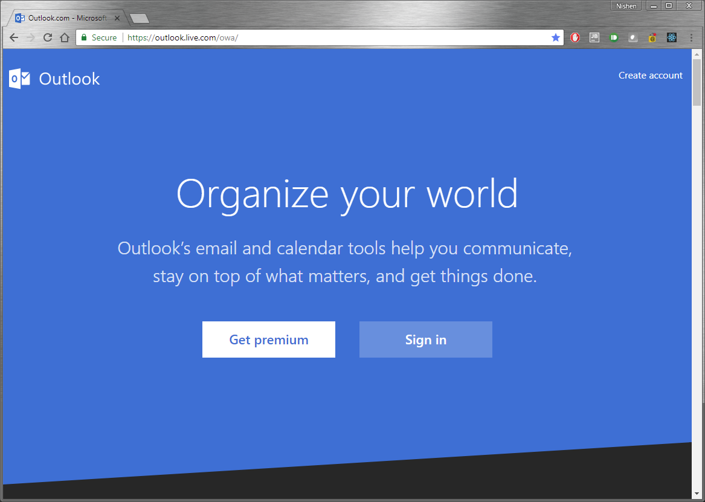
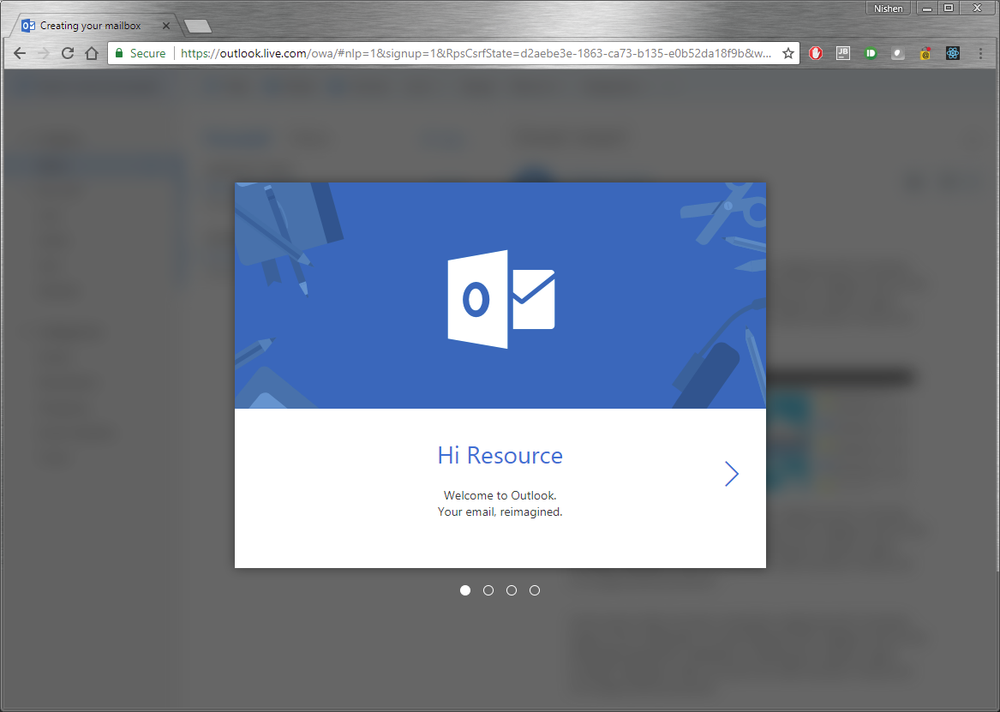
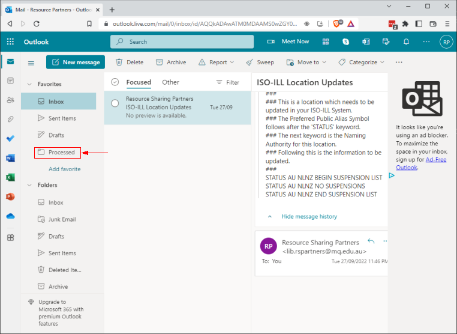

# Partner Synchronisation with Alma - Outlook Configuration
__[HOME](README.md)__

## Outlook Configuration
The first step is to create an Outlook account if you do not already have one. It is also possible to use a Microsoft365 institution account, but this will require some work to be done by your IT team that manages the Microsoft365 __'Organisation'__ to configure an __'App Registration'__. The Outlook account is required to receive Tepuna Status emails.

The second step is to create an __'App Registration'__. This enables programmatic access to the Outlook account so that the harvesting application can access the account and read/move emails.

We will cover both these tasks in detail.

## Creating an Outlook Account
You can simply go to https://outlook.live.com and create a new account. Select the Create account link in the top right corner.

Once you've created your account and logged in, you will need to create a new folder called 'Processed'. This is where Tepuna emails are moved once they are processed.

## Creating an App Registration
You will also need to configure the account to support OAuth2 login access. The process for this is outlined here: https://learn.microsoft.com/en-us/outlook/rest/get-started

The URL for managing REST applications: https://apps.dev.microsoft.com/
