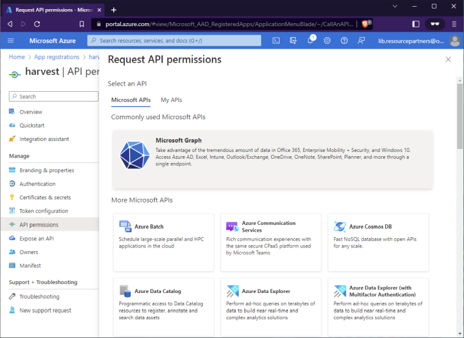

# Outlook Configuration
__[HOME](README.md)__

## Outlook Configuration
The first step is to create an Outlook account if you do not already have one. It is also possible to use a Microsoft365 institution account, but this will require some work to be done by your IT team that manages the Microsoft365 __'Organisation'__ to configure an __'App Registration'__. The Outlook account is required to receive Tepuna Status emails.

The second step is to create an __'App Registration'__. This enables programmatic access to the Outlook account so that the harvesting application can access the account and read/move emails.

We will cover both these tasks in detail.

## Creating an Outlook Account

1. Create an Outlook Account. You can simply go to https://outlook.live.com and create a new account. Select the Create account link in the top right corner.

   

   

2. Once you've created your account and logged in, you will need to create a new folder called 'Processed'. This is where Tepuna emails are moved once they are processed.
 
   

## Creating an App Registration
Creating an __App Registration__ allows the harvest application to interact programmatically with the Outlook account via the [Microsoft Graph API](https://learn.microsoft.com/en-us/outlook/rest/get-started).

Some additional reading (optional):
- [OAuth2 using Microsoft AD](https://learn.microsoft.com/en-us/azure/active-directory/develop/)
- [Registering an Application](https://learn.microsoft.com/en-us/azure/active-directory/develop/quickstart-register-app)


1. Login to the Azure Portal using the same credentials as the Outlook account. This will take you to the Azure Management Portal for managing App Registrations.

   [Azure Portal ](https://portal.azure.com/)

   

2. In the search box at the top, search for 'app registrations'. This should filter down the list of services to App Registrations which you will see in the list under the search box. Select __'App registrations'__ which will take you to the __App registration__ management page.
   

3. Select __New Registration__.
   

4. Register an application. Select a name (_harvester_ is a good exampe and is perfectly fine). The supported account type should be 'Personal Microsoft accounts only' provided you are using one of the free accounts for Outlook. If you are using an Organisation account, then you would choose 'Accounts in any organizational directory'. However, if that is the case, you would typically require a IT Administrator to create the App Registration.
   
   Set the Redirect URI to __'Web'__ and __'http://localhost/outlook'__. This will come in to play a bit later. Click on the Register button.

   

5. You should now have an app registered.
   

6. Click on the app that you just created. It should take you to the screen that allows you to configure the various aspects of the application.
   
   There are four areas we are going to configure:
   1. Branding & properties
   2. Authentication
   3. Certificates & secrets
   4. API permissions

   

7. Configure __Branding & properties__. This is not mandatory, but if you want to add any specifics to this page, you can do so.
   

8. Configure __Authentication__. Here, ensure that the Web section has a Redirect URI of http://localhost/outlook. Also ensure the __Access tokens__ and __ID tokens__ boxes are checked.
   

9. Configure __Certificates & secrets__. Select the __Client secret__ tab, then click __New client secret__. On the __Add a client secret__ screen, add a description and select Expires as 24 months.
   

   Once the secret is created, copy and save the secret value immediately. __Once you leave this page, you will not be able to retrieve the secret again and will need to create a new secret__.
   
   

10. Configure __API permissions__. Here we add the permissions that this App registration will have. We need to give it the ability to Read and Write to the accounts Mailbox. The __User.Read__ permissions should already be set. We need to add one additional permission: Mail.ReadWrite.

    Click on __Add a permission__ and select Microsoft Graph (which should be at the top).
    

    You will then be asked for the type of permissions required. Select __Delegated permissions__.
    
    
    You will then be presented with a list of permissions categories. Scroll down to __Mail__. Expand this category and then select __Mail.ReadWrite__. Finish by clicking on the __Add permissions__ button at the bottom.
    

    You should now see a screen with two permissions granted:
    - Mail.ReadWrite
    - User.Read
    
    

__Congratulations! You are done!__

## Generating an Access Token
Now that our Outlook account is configured, and our App is registered, the last thing we need to do is create an __Access Token__ for our Harvest app to use.There are many different options to achieve this, but we will cover one that is simple but does require the use of PHP.

1. If you don't currently have PHP installed, you will need to download and install it. If you are running Windows, this might help: [Installing PHP on Windows Systems](https://www.php.net/manual/en/install.windows.php).
   
   We don't need any complex functionality. We just need it to run the builtin PHP web server and process a simple PHP file.

2. In the __project/docs/outlook-oauth2__ folder is a folder called '__outlook__'. Copy this folder somewhere accessable. Let us assumed that you placed it in __C:\Temp\rsp__ resulting in __C:\Temp\rsp\outlook__ 

3. Edit the file __C:\Temp\rsp\outlook\index.html__.
   - Change the __client_id=__ to the Client ID from your App registration.
   - At the end of the line, change the Login: ____@____ to the Outlook email address.
   
   Edit the file __C:\Temp\rsp\outlook\lib.resourcepartners.php__.
   - Change the __<input type="hidden" name="client_id" value="xxx" />__ to the Client ID from your App registration.
   - Change the __<input type="hidden" name="client_secret" value="xxx" />__ to the Client secret you generated in your App registration.

4. Open a command prompt/windows terminal and go to __C:\Temp\rsp__ (the folder that contains the __outlook__ folder).
   
5. Execute the following:
   ```bash
   php -S 127.0.0.1:80
   ```

6. Open a browser in Private/Incognito mode (safest) and go to ___http://localhost/outlook___
   

7. Click on the Login link and enter the credentials for the Outlook account.
   

8. This should return you to the Outlook folder served up by the PHP server.
   

9. Click on the Generate Token button. You will be presented with the generated Token. Copy this token and save it to the java application configuration folder: __data/config/OUTLOOK.json__
  
   

10. If you ever need to regenerate your tokens again, you can save the __outlook__ folder and perform steps 5-9 again. It is not common to have to regenerate tokens but can happen. I've not had to regenerate a token for the harvester for over 3 years now.

__All done!__
